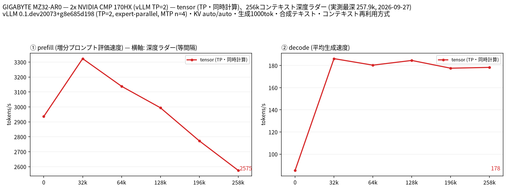

# CMP 170HX 2 枚で Qwen3.8 Flash Next（W4A16・MoE）を vLLM TP=2 で 258k コンテキストまで計測

- **作成者**: moriyasujapan
- **作成日**: 2026-09-27

## 概要

マイニング向け GA100 カード **NVIDIA CMP 170HX（nvidia-smi 上 65,536 MiB）2 枚**で、Qwen3.8 Flash Next の W4A16 量子化版を vLLM の tensor parallel（TP=2）で動かし、262k コンテキストまでの prefill / decode を深度ラダーで計測しました。

prefill は 258k 深度でも 2,575 tok/s を保ち、decode は**合成テキストでは 178 tok/s、実運用相当の生成では 69.7 tok/s** でした。この 2.6 倍の差はすべて MTP（投機デコード）の採択率の差（0.93 対 0.21）で説明でき、**MTP 搭載モデルを合成ラダーだけで測ると decode を大幅に過大評価する**ことが本計測の主眼です。

なお本レポートは **llama-split-bench を使っていません**。計測対象が常駐の vLLM サーバで、同ツールが前提とする llama.cpp の `llama-server` 起動と `/completion` の `timings` が使えないためです。プロトコルと出力スキーマは llama-split-bench に合わせ、図は同リポジトリの `plot_bench.py` で生成しています（詳細は「条件」）。

## ハードウェア

| 項目 | 内容 |
|------|------|
| コンピュータ / マザーボード | GIGABYTE MZ32-AR0-00 |
| GPU | NVIDIA CMP 170HX × 2（nvidia-smi 報告値 65,536 MiB / 枚、compute capability 8.0 = GA100、VBIOS 92.00.6D.00.0A） ※同一マシンに RTX 5060 Ti 16GB × 2 も搭載しているが、本計測には未使用 |
| GPU 接続 | PCIe 2.0 x16（`pcie.link.gen.max` / `width.max` も 2 / 16）、NVLink なし、`nvidia-smi topo -m` は 2 枚間 PHB（同一 PCIe ホストブリッジ経由） |
| 電力制限 | 300 W / 枚 |
| CPU | AMD EPYC 7302 16-Core（32 スレッド、1 ソケット） |
| メモリ | 約 92 GiB（種別は sudo 無しでは取得できず不明） |
| 電源 | 不明 |

CMP 170HX は本来マイニング専用 SKU で、製品仕様上の VRAM は 8GB HBM2e です。本機の 2 枚は nvidia-smi が **65,536 MiB** を報告し、実際に 64,349 MiB を使用した状態で 258k コンテキストの推論が通っています。本レポートには**計測できた値をそのまま記載**しており、この容量差の由来（基板・VBIOS の改変等）は確認していません。

## ソフトウェア環境

| 項目 | 内容 |
|------|------|
| OS | Ubuntu 26.04.1 LTS / kernel 7.0.0-34-generic |
| GPU ドライバ | NVIDIA 615.71.09 |
| 推論エンジン | **vLLM 0.1.dev20073+g8e685d198**（llama.cpp ではない） コンテナイメージ `vllm/vllm-openai:qwen38-flash-next-x86_64-cu130`（CUDA 13.0） サーバ fingerprint `vllm-0.1.dev20073+g8e685d198-tp2-ep-6d91553e` |
| 並列化 | tensor parallel = 2、expert parallel 有効 |
| PLE | per-layer embedding を FP8（e4m3）で CPU オフロード（`VLLM_PLE_CPU_OFFLOAD=1`） |
| 計測ハーネス | 自作 `vllm-split-bench.py`（添付）。図は llama-split-bench `7af72d4` の `plot_bench.py` |

この構成は上流の素の vLLM ではなく、モデルカードが指定する**カスタム vLLM オーバーレイ**（`multiproc_executor.py` / `ple_offload/` / `gpu_worker.py` の差し替え）を前提としています。

## ベンチマーク

### 条件

| 項目 | 内容 |
|------|------|
| ツール | **llama-split-bench は未使用**。自作 `vllm-split-bench.py`（llama-split-bench `7af72d4` のプロトコル・出力スキーマに準拠） |
| モデル | `Qwen3.8-Flash-Next-heretic2-W4A16-densohax`（revision `705a2ce`、重み実測 74 GB、49 shards） base: `Qwen/Qwen3.8-Flash-Next` ＋ `trohrbaugh/Qwen3.8-Flash-Next-heretic-2` ＋ `RadixArk/Qwen3.8-Flash-Next-NVFP4` |
| 量子化 | GPTQ / AutoRound 0.15.1、4bit、group_size 128、symmetric、desc_act 無効、**MTP 層は非量子化**（`dynamic: {"-:.*mtp.*": {}}`） |
| モデル構成 | 48 層（linear attention 36 / full attention 12、interval 4）、hidden 2560、24 heads / 2 KV heads、head_dim 256、512 エキスパート中 top-10 ＋ shared expert、vocab 248,320 |
| 測定モード | tensor（vLLM TP=2）の 1 構成のみ。稼働中サーバのため layer / 単一 GPU との比較は不可 |
| ctx / stages | 262,144 / `0,32000,64000,128000,196000,258000` |
| KV キャッシュ | `--kv-cache-dtype auto`、`--kv-cache-memory 24,383,208,960`（22.7 GiB） |
| 投機的デコード | **MTP `num_speculative_tokens=4`**（有効） |
| その他サーバ設定 | `--max-num-seqs 8`、`--max-num-batched-tokens 1024`、`--gpu-memory-utilization 0.92`、`FULL_DECODE_ONLY` cudagraph |
| 生成長 | 各段 1,000 トークン（`ignore_eos`） |

**計測方法の対応**（llama.cpp の `timings` が無いため、クライアント側で等価な値を算出）:

| llama.cpp の値 | 本計測での算出 |
|----------------|----------------|
| `prompt_per_second` | （今回新規に評価されたプロンプトトークン数）/ TTFT |
| `predicted_per_second` | `completion_tokens` /（総時間 − TTFT） |
| `cache_n` | vLLM `/metrics` の `prefix_cache_hits_total` 差分 |
| `draft_n` / `draft_n_accepted` | vLLM `/metrics` の `spec_decode_*` 差分 |

なお本計測は**占有したマシンではなく、稼働中の共有サーバに対して**実行しました。各段の直前に `num_requests_running == 0` を確認しています。

### 結果

#### 深度ラダー（合成テキスト、temp 0）

| 深度 | 新規評価トークン | キャッシュ再利用 | prefill (t/s) | decode (t/s) | MTP 採択率 |
|------|------------------|------------------|---------------|--------------|------------|
| 0（pp2048） | 2,050 | 0 | **2,936** | 139.9 | — |
| 0（pp8192） | 8,189 | 0 | **3,268** | 156.6 | — |
| 31,998 | 30,382 | 1,616 | **3,323** | **186.2** | 0.943 |
| 63,990 | 34,902 | 29,088 | **3,138** | **180.3** | 0.928 |
| 127,993 | 66,585 | 61,408 | **2,994** | **184.6** | 0.946 |
| 195,995 | 69,947 | 126,048 | **2,773** | **177.6** | 0.921 |
| 257,947 | 64,027 | 193,920 | **2,575** | **178.3** | 0.933 |

図の decode パネルの深度 0 の点（85.3 t/s）は、ラダー初段が 11 トークンの短いプロンプトで MTP 採択率が 0.276 までしか上がらないための計測上のアーティファクトです。prefill 側は llama-split-bench の作法どおり pp0 実測値（2,936 t/s）に差し替えています。

#### 補足: 同じ深さで「実運用相当の生成」に替えた場合（temp 0.7 / top_p 0.9）

同じキャッシュ済みコンテキストの末尾の指示だけを「数列の続きを書け」から「別の話題を自分の言葉で論じよ」に替え、生成内容だけを実運用側に寄せた計測です。

| 深度 | decode (t/s) 合成 | decode (t/s) 実運用相当 | 採択率 合成 | 採択率 実運用相当 |
|------|-------------------|--------------------------|-------------|--------------------|
| ~0 | 85.3 | **86.0** | 0.276 | 0.318 |
| 32k | 186.2 | **97.1** | 0.943 | 0.394 |
| 128k | 184.6 | **89.1** | 0.946 | 0.347 |
| 258k | 178.3 | **69.7** | 0.933 | 0.213 |

短い実プロンプト 3 本（llama-split-bench 同梱のワークロード代理）では decode 87.0 / 91.0 / 100.4 t/s、採択率 0.33〜0.41 でした。

#### 参考: モデルカードの 2× RTX 3090 での公称値

配布元モデルカードが同じ重みの 2× RTX 3090 24GB ＋ 128GB RAM での値を公開しています。生成長・キャッシュ状態・ランタイムが異なるため厳密な A/B ではありませんが、桁感の参考として併記します。

| 構成 | 深度 | prefill (新規トークン基準) | decode |
|------|------|-----------------------------|--------|
| 2× RTX 3090（モデルカード） | 131,072 | 1,727 t/s ※total/TTFT 基準 | 89.1 t/s |
| 2× RTX 3090（モデルカード） | 260,096 | 1,860 t/s ※total/TTFT 基準 | 86.2 t/s |
| 2× RTX 3090（モデルカード smoke） | — | 1,478 t/s（新規トークン基準） | 79.4 t/s |
| **2× CMP 170HX（本計測）** | 127,993 | **2,994 t/s**（新規トークン基準） | 89.1 t/s（実運用相当） |
| **2× CMP 170HX（本計測）** | 257,947 | **2,575 t/s**（新規トークン基準） | 69.7 t/s（実運用相当） |

### 所感

- **prefill は CMP 170HX の方が明確に速い。** 新規トークン基準で 2,575〜3,323 t/s 出ており、モデルカードの 3090 smoke 値（1,478 t/s）の約 1.7〜2.2 倍です。GA100 の HBM2e 帯域が効いていると考えられます。PCIe 2.0 x16・NVLink 無しという貧弱な接続でも、TP=2 の prefill はここまで出ました。
- **深度による prefill の劣化は緩やか。** 32k で 3,323 t/s、258k でも 2,575 t/s と、8 倍の深さに対して −22% に留まります。48 層中 36 層が linear attention というハイブリッド構成が効いていると思われます。
- **decode の数字は「何を生成させたか」で 2.6 倍変わる。** 合成ラダーの 178 t/s は MTP 採択率 0.93 に支えられた値で、同じ深さでも実運用相当の生成では 69.7 t/s まで落ちます。MTP / 投機デコードを有効にしたモデルを合成テキストのラダーだけで測ると decode を大幅に過大評価するため、**採択率を必ず併記すべき**というのが本計測の一番の教訓でした。llama-split-bench が実プロンプト補正係数を別途測っているのは、まさにこの問題への対処だと理解しています。
- **実運用相当の decode は深さに効く。** 32k の 97 t/s から 258k で 70 t/s へ −28%。採択率も 0.39 → 0.21 と下がっており、深いコンテキストでは MTP ドラフトが当たりにくくなることが decode 低下の主因のようです。単純な KV 読み出しコストだけでは説明できません。
- **llama-split-bench の実プロンプト補正係数の式は、MTP モデルでは注意が必要。** 同ツールは「実プロンプト decode ÷ ラダー深度 0 の decode」で係数を出しますが、深度 0 自体が短すぎて採択率が上がらないため、本計測では係数が 1.088 となり想定レンジ（0.7〜0.9）を外れました。ラダーの深い段と比べると実際は約 0.51 です。図は誤解を避けるため `--estimate off` で生成しています。
- **消費電力は 300 W 制限に対して大きく余裕がある。** 各段の直後に 1 点ずつ取ったサンプルでは 1 枚あたり 64〜151 W（2 枚合計でおおむね 150〜290 W）、温度 36〜47℃ でした。連続サンプリングではなく各段 1 点のみなので定常値としては粗い値ですが、300 W / 枚の制限に張り付く場面は観測されませんでした。生データは `results-tensor.json` の `gpu_before` / `gpu_after` にあります。

## 添付

- [split-bench-ja.png](attachment/2026-09-27_153558_measuring_qwen3.8_flash_next_w4a16_on_2x_cmp_170hx_with_vllm_tp2/split-bench-ja.png) / [split-bench-en.png](attachment/2026-09-27_153558_measuring_qwen3.8_flash_next_w4a16_on_2x_cmp_170hx_with_vllm_tp2/split-bench-en.png)
- [run-info.json](attachment/2026-09-27_153558_measuring_qwen3.8_flash_next_w4a16_on_2x_cmp_170hx_with_vllm_tp2/run-info.json)
- [results-tensor.json](attachment/2026-09-27_153558_measuring_qwen3.8_flash_next_w4a16_on_2x_cmp_170hx_with_vllm_tp2/results-tensor.json)（深度ラダー、GPU テレメトリ込み）
- [results-tensor-pp0.json](attachment/2026-09-27_153558_measuring_qwen3.8_flash_next_w4a16_on_2x_cmp_170hx_with_vllm_tp2/results-tensor-pp0.json)（深さ 0 の prefill）
- [results-real.json](attachment/2026-09-27_153558_measuring_qwen3.8_flash_next_w4a16_on_2x_cmp_170hx_with_vllm_tp2/results-real.json)（実プロンプト補正）
- [results-real-depth.json](attachment/2026-09-27_153558_measuring_qwen3.8_flash_next_w4a16_on_2x_cmp_170hx_with_vllm_tp2/results-real-depth.json)（深さ別の実運用相当 decode）
- [argv-tensor.txt](attachment/2026-09-27_153558_measuring_qwen3.8_flash_next_w4a16_on_2x_cmp_170hx_with_vllm_tp2/argv-tensor.txt)（vLLM サーバの起動引数）
- [vllm-split-bench.py](attachment/2026-09-27_153558_measuring_qwen3.8_flash_next_w4a16_on_2x_cmp_170hx_with_vllm_tp2/vllm-split-bench.py)（計測ハーネス）
- [depth_real.py](attachment/2026-09-27_153558_measuring_qwen3.8_flash_next_w4a16_on_2x_cmp_170hx_with_vllm_tp2/depth_real.py)（深さ別の実運用相当 decode の計測）
- [plot_bench-engine_label.patch](attachment/2026-09-27_153558_measuring_qwen3.8_flash_next_w4a16_on_2x_cmp_170hx_with_vllm_tp2/plot_bench-engine_label.patch)（図の副題を llama.cpp 固定から `engine_label` 優先に変える 1 行パッチ）
