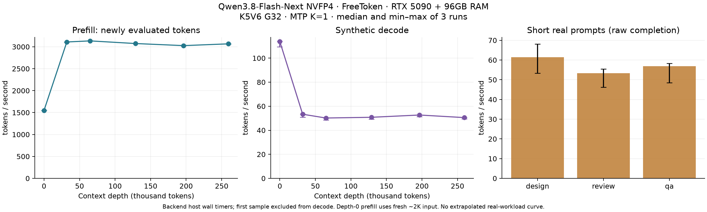

# RTX 5090 1枚でQwen3.8-Flash-Next NVFP4をFreeTokenで約260K入力まで計測

- **作成者**: centra
- **作成日**: 2026-09-28

## 概要

RTX 5090 1枚とRAM 96GBの構成で、改修版FreeTokenによるQwen3.8-Flash-Next Uncensored NVFP4の速度を測定した。最大259,601トークン入力＋1,000トークン生成を含む3周・36測定を完走し、最大入力での生成速度の中央値は **50.5 tok/s**、短い実用プロンプト9測定の中央値は **55.4 tok/s**だった。

llama-split-benchのプロンプトと測定段階を参照し、FreeToken用アダプターで実行した。llama.cppのネイティブ計時を取得した結果ではない。モデルの派生・変換、推論エンジン、計時方法が異なるため、他の投稿との比較では以下の条件を併せて確認してほしい。

## ハードウェア

| 項目 | 内容 |
| --- | --- |
| コンピュータ / マザーボード | ASRock Z890 Pro RS WiFi |
| CPU | Intel Core Ultra 7 265K |
| メモリ | 96GB（OS表示約93 GiB） |
| GPU | NVIDIA GeForce RTX 5090 × 1（32,607 MiB） |
| GPU接続 | PCIe Gen5 x16 |

## ソフトウェア環境

| 項目 | 内容 |
| --- | --- |
| OS | NixOS 25.11、Linux 6.12.93 |
| GPUドライバ | NVIDIA 580.142 |
| バックエンド | 改修版FreeToken `a72b8e3979021888ee3f0a429a816e572c660605` + 計測用パッチ |
| Python / PyTorch | 3.12.13 / 2.11.0+cu130 |
| Triton / FlashInfer / Transformers | 3.6.0 / 0.6.18 / 5.16.1 |

FreeTokenのソースは[このコミット](https://git.centraworks.net/centra/freetoken/commit/a72b8e3979021888ee3f0a429a816e572c660605)。計測用パッチは添付した。計測の間にモデル設定の変更やbackendの再起動は行っていない。

## ベンチマーク

### モデルと実行条件

| 項目 | 内容 |
| --- | --- |
| モデル | orcarouter/Qwen3.8-Flash-Next-Uncensored-NVFP4 |
| ツール | FreeToken adapter、llama-split-benchのプロトコルを参照 |
| プロトコル参照版 | llama-split-bench `7af72d4085aa5073677d41389144112dd94fcb74` |
| Expert | NVFP4、host offload、GPU cache 4,816 slots（うちscratch 512） |
| 常駐重み | attention・shared expert・LM headはFP8 W8A16 |
| PLE | 約47.684 GiBのFP8 host mmap |
| KV cache | K5V6 group32、10,000 pages × 64 = 640,000 tokensを共有 |
| Mamba state / prefix state | 32 slots / linear-state-cache-ratio=0 |
| 1要求の最大長 / prefill chunk | 262,144 tokens / 4,096 tokens |
| MTP | K=1、draft Expert NVFP4、draft cache 80 slots |
| 同時処理 | 設定上限8要求、測定は1要求ずつ。visionもロードした通常の構成 |
| 繰り返し | 同じ入力・設定で3周。各周に8トークンのwarmup |

モデルはFreeToken向けに変換したアーティファクトを使用した。元モデル名だけで変換済み重み・PLEを再現できるわけではない。設定・tokenizer等のハッシュと実際の環境変数は添付の`run-info.json`に保存した。重み全体の同一性や他の量子化との品質同等性を検証した測定ではない。

### コンテキスト長別の速度

単位はtok/s。表は各条件3回の中央値。`depth`は名目の目標長であり、実トークン数は次の表に示す。depth 0のprefillには、基準に合わせて独立した新規約2K入力の測定値を使用した。

| depth | prefill FreeToken | decode FreeToken |
| --- | ---: | ---: |
| 0 | 1548.9 | 113.8 |
| 32k | 3109.3 | 53.3 |
| 64k | 3133.9 | 50.2 |
| 128k | 3073.6 | 50.8 |
| 196k | 3026.2 | 52.7 |
| 258k | 3066.6 | 50.5 |

基準の繰り返し文と末尾指示を使用し、各段階で1,000トークン生成。temperature=0、top_p=1、top_k=0、EOSを無視したraw completion。depth 0の生成は基準の短い首都の質問（実入力11トークン）を使用する。チャットテンプレートやthinking無効化の指示は追加していない。

| 名目depth | 実入力 tokens | 再利用 tokens（3回とも同じ） | 新しく評価した tokens | Prefill 最小–最大 tok/s | Decode 最小–最大 tok/s |
| --- | ---: | ---: | ---: | ---: | ---: |
| 0（生成用） | 11 | 0 | 11 | — | 109.4–114.1 |
| 32k | 32,093 | 0 | 32,093 | 3,104.1–3,110.0 | 51.0–53.4 |
| 64k | 64,806 | 0 | 64,806 | 3,129.7–3,136.8 | 48.6–50.2 |
| 128k | 128,788 | 64,768 | 64,020 | 3,073.2–3,078.0 | 49.2–50.8 |
| 196k | 196,429 | 64,768 | 131,661 | 3,024.7–3,027.5 | 51.4–52.7 |
| 258k | 259,601 | 64,768 | 194,833 | 3,064.3–3,066.9 | 49.3–50.5 |

各周の最初にprefix cacheを消去し、同じ周では再利用を許可した。prefill速度の分子は**今回新しく評価したトークン数**であり、再利用されたトークンを含めない。32k・64kでは再利用なし、128k以降では64,768トークンを再利用した。最大長の結果は、259,601トークン全体を毎回新規に読み込んだ条件ではない。

入力文はlocal tokenizerで長さを確認して一度だけ作成し、3周で共用した。stockが要求後に文字数/token比を更新する方式とは少し異なる。最終的な長さにはサーバーが返したトークン数を使用した。

### 新規入力のprefill

各入力前にprefix cacheを消去し、基準の繰り返し文を入力して64トークン生成した。中央値（最小–最大）、単位tok/s。

| 名目入力 | 実入力 tokens | Prefill tok/s |
| ---: | ---: | ---: |
| 512 | 512 | 406.3（401.1–406.7） |
| 2048 | 1,978 | 1,548.9（1,547.0–1,550.3） |
| 8192 | 8,077 | 3,124.8（3,102.3–3,128.9） |

ここで未使用状態にするのはKV prefixのみ。OSページキャッシュ・Expert cache・PLEまで冷えた状態にはしていない。各周の測定順序は、新規prefill、長文の連続測定、実用プロンプトの順。warmupと事前smokeは集計に含めていない。

### 短い実用プロンプト

基準のdesign / review / qaをそのまま使用。temperature=0.7、top_p=0.9、top_k=0、出力上限1,200、EOSを許可、seed固定なし。各入力前にprefix cacheを消去した。3回の中央値（最小–最大）。

| プロンプト | 入力 tokens | Decode tok/s | クライアントTTFT ms | 出力 tokens（各回） |
| --- | ---: | ---: | ---: | ---: |
| design | 73 | 61.4（53.4–68.1） | 1,338（1,272–1,874） | 1,200 |
| review | 58 | 53.4（46.2–55.4） | 1,273（1,267–1,700） | 1,200 |
| qa | 61 | 56.9（48.5–58.3） | 1,280（1,269–1,712） | 1,200 |

全9測定の生成速度中央値は **55.4 tok/s**（46.2–68.1）。すべて終了理由は`length`で、出力上限で打ち切られた。思考文もトークン数に含む。回答を最後まで完了する速度や回答品質を評価した結果ではない。これらの短い実用入力の値を、長文の実用速度へ外挿していない。

### FreeToken用の計時とキャッシュ制御

- `/v1/completions`を使用。schedulerで最初のprefill受け入れ時刻と、既存のGPU同期後に最初・最後の生成トークンを公開する時刻を記録した。追加のGPU同期やトークンごとのファイル書き込みは行っていない。
- **Prefill時間**は受け入れから最初の公開までのホスト経過時間。chunk間処理、MTP catch-up、最初のsamplingを含み、frontendのtokenizeや受け入れ前の待機は含まない。CUDA kernel時間の合計ではなく、llama.cppのネイティブtimerとの同一性は主張しない。
- **Decode速度**は、全生成数から最初の公開batchのトークン数を引き、最初から最後の公開までの時間で割った値。今回の最初の公開batchは1トークンで、1,000トークン生成時の分子は999となる。
- **TTFT**は独立にクライアントで測定。API usageとbackend計測の入力・再利用・生成トークン数を全要求で照合し、合成測定では出力数と終了理由も確認した。
- prefixの消去は計測用コピーに加えたidle時専用処理。物理KV pool・CUDA graph・Expert常駐・PLE mmapを保持し、prefix所有権と関連する空き状態を再構成する。通常の同容量cache rebuildは準備時のメモリ予算再判定で拒否されたため、同じ物理容量を維持した消去処理を計測外で使用した。
- MTP採用率は基準のdraft counterとの対応を確認していないため、比較値を載せていない。計測用パッチとプロトコルを添付した。

### 検証とリソース

長文18件、新規prefill 9件、実用9件の計36件を単一backend instanceで完了した。長文6段階すべてで生成テキストのSHA-256が3周とも一致した。これは同条件での再現性を確認する補助チェックであり、内容の正しさを評価したものではない。

2026-09-28 15:12〜15:29 JSTの測定中、1秒ごとに採取した1,052サンプルでは、GPUメモリ使用量の最大31,356 MiB、空き最小1,251 MiB、GPU温度の最大53°C、電力の最大433.1 W、ホストMemAvailableの最小21.78 GiBだった。サブ秒の瞬間的なピークを保証する数値ではない。

## 添付

- [グラフPNG](attachment/2026-09-28_172024_measuring_qwen3.8_flash_next_nvfp4_with_freetoken_on_rtx5090/benchmark.png)
- [集計JSON](attachment/2026-09-28_172024_measuring_qwen3.8_flash_next_nvfp4_with_freetoken_on_rtx5090/summary.json)、[全条件CSV（TXT形式）](attachment/2026-09-28_172024_measuring_qwen3.8_flash_next_nvfp4_with_freetoken_on_rtx5090/results.csv.txt)
- 長文結果：[1周目](attachment/2026-09-28_172024_measuring_qwen3.8_flash_next_nvfp4_with_freetoken_on_rtx5090/results-freetoken-r1.json)・[2周目](attachment/2026-09-28_172024_measuring_qwen3.8_flash_next_nvfp4_with_freetoken_on_rtx5090/results-freetoken-r2.json)・[3周目](attachment/2026-09-28_172024_measuring_qwen3.8_flash_next_nvfp4_with_freetoken_on_rtx5090/results-freetoken-r3.json)
- 新規prefill：[1周目](attachment/2026-09-28_172024_measuring_qwen3.8_flash_next_nvfp4_with_freetoken_on_rtx5090/results-freetoken-pp0-r1.json)・[2周目](attachment/2026-09-28_172024_measuring_qwen3.8_flash_next_nvfp4_with_freetoken_on_rtx5090/results-freetoken-pp0-r2.json)・[3周目](attachment/2026-09-28_172024_measuring_qwen3.8_flash_next_nvfp4_with_freetoken_on_rtx5090/results-freetoken-pp0-r3.json)
- 実用プロンプト：[1周目](attachment/2026-09-28_172024_measuring_qwen3.8_flash_next_nvfp4_with_freetoken_on_rtx5090/results-real-r1.json)・[2周目](attachment/2026-09-28_172024_measuring_qwen3.8_flash_next_nvfp4_with_freetoken_on_rtx5090/results-real-r2.json)・[3周目](attachment/2026-09-28_172024_measuring_qwen3.8_flash_next_nvfp4_with_freetoken_on_rtx5090/results-real-r3.json)
- [設定・環境・元ファイルのハッシュ](attachment/2026-09-28_172024_measuring_qwen3.8_flash_next_nvfp4_with_freetoken_on_rtx5090/run-info.json)、[プロトコル](attachment/2026-09-28_172024_measuring_qwen3.8_flash_next_nvfp4_with_freetoken_on_rtx5090/protocol.txt)、[再現手順](attachment/2026-09-28_172024_measuring_qwen3.8_flash_next_nvfp4_with_freetoken_on_rtx5090/reproduce.txt)
- [アダプター](attachment/2026-09-28_172024_measuring_qwen3.8_flash_next_nvfp4_with_freetoken_on_rtx5090/bench.py.txt)、[起動スクリプト](attachment/2026-09-28_172024_measuring_qwen3.8_flash_next_nvfp4_with_freetoken_on_rtx5090/launch.py.txt)、[リソース採取](attachment/2026-09-28_172024_measuring_qwen3.8_flash_next_nvfp4_with_freetoken_on_rtx5090/monitor.py.txt)、[計測用パッチ](attachment/2026-09-28_172024_measuring_qwen3.8_flash_next_nvfp4_with_freetoken_on_rtx5090/source-instrumentation.patch.txt)
- [添付ファイルのSHA-256](attachment/2026-09-28_172024_measuring_qwen3.8_flash_next_nvfp4_with_freetoken_on_rtx5090/SHA256SUMS.json)

スクリプト・パッチ・CSVはサイトの添付形式に合わせて`.txt`を付けた。生の生成文、プロンプト本文、server log、モデルファイルは含めていない。CSVのdepth 0のprefillは実入力11トークンの生測定値であり、本文の代表表・グラフで用いた新規約2Kの値とは区別して保存している。

プロトコルの参照元：[llama-split-bench固定版](https://github.com/kuraneko1/llama-split-bench/tree/7af72d4085aa5073677d41389144112dd94fcb74)。
